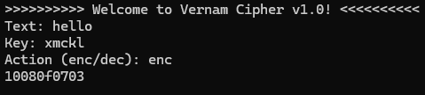

# Vernam Cipher

The Vernam cipher, also known as the one-time pad, is a symmetric key cipher where each character of the plaintext is combined with 
a character from a random key of the same length using the XOR operation. When the key is truly random and used only once, the Vernam cipher 
is theoretically unbreakable.

## Example

Plaintext: hello  
Key: xmckl  
Ciphertext: 10080f0703

## Console Output

