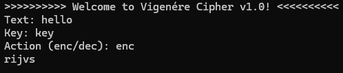

# Vigenère Cipher

The Vigenère cipher is a polyalphabetic substitution cipher that uses a keyword to encrypt a message. 
Each letter of the plaintext is shifted by a number of positions determined by the corresponding letter of the keyword. 
This method makes the cipher more resistant to frequency analysis compared to simple substitution ciphers.

## Example

Plaintext: hello  
Keyword: key  
Ciphertext: rijvs

## Console Output

