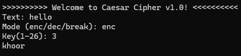

# Caesar Cipher

The Caesar cipher is one of the simplest and most widely known encryption techniques. 
It works by shifting each letter in the plaintext by a fixed number of positions down the alphabet. 
For example, with a shift of 3, 'A' becomes 'D', 'B' becomes 'E', and so on. 
This method is named after Julius Caesar, who reportedly used it to protect his messages.

## Example

Plaintext: hello  
Shift: 3  
Ciphertext: khoor

## Console Output

