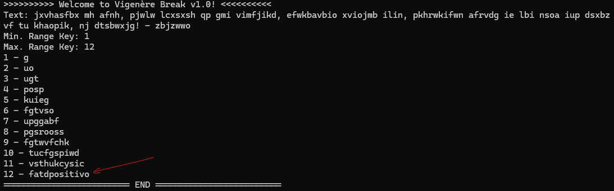
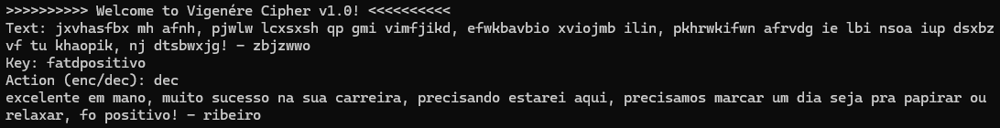

# Vigenère Cipher Breaker

The Vigenère cipher breaker is a cryptanalysis tool that attempts to break Vigenère ciphers using frequency analysis and statistical methods. This implementation is based on chi-square statistical analysis and Portuguese letter frequencies.

## How It Works

1. **Key Length Testing**: Tests different possible key lengths within a specified range
2. **Column Separation**: Splits the ciphertext into columns based on the suspected key length
3. **Caesar Analysis**: Applies Caesar cipher breaking techniques to each column
4. **Frequency Analysis**: Uses chi-square statistics with Portuguese letter frequencies
5. **Key Reconstruction**: Combines the best-fit characters from each column

## Features

- Supports key length ranges from 1 to any reasonable upper limit
- Uses Portuguese letter frequency analysis for better accuracy with Portuguese texts
- Handles mixed case input (converts to lowercase)
- Ignores non-alphabetic characters during analysis
- Returns all possible keys for the specified length range

## Usage

### Programmatic Usage

```csharp
var breaker = new VigenereBreaker();
var results = breaker.BreakCipher(ciphertext, minKeyLength, maxKeyLength);

foreach (var (keyLength, possibleKey) in results)
{
    Console.WriteLine($"Key Length {keyLength}: {possibleKey}");
}
```

### Interactive Console Usage

```csharp
var breaker = new VigenereBreaker();
breaker.Run(); // Prompts for input via console
```

## Limitations

- **Statistical Nature**: Results depend on the text having sufficient length and following expected letter frequency patterns
- **Language Dependency**: Optimized for Portuguese text; may be less accurate with other languages
- **Short Text Limitation**: Very short texts may not provide enough statistical data for accurate analysis
- **Key Length Dependency**: Longer keys require proportionally more text for reliable analysis

## Example

### Discovering the Key

The following example shows how the breaker analyzes ciphertext to discover the encryption key:



### Decrypting with the Discovered Key

Once the key is discovered, it can be used to decrypt the original ciphertext:



## Technical Details

- Uses Portuguese letter frequency table for chi-square analysis
- Implements statistical frequency analysis for each character position
- Applies Caesar cipher breaking techniques to individual columns
- Optimized for texts with at least 50-100 characters for reliable results

## Console Output

The breaker provides formatted output showing possible keys for each tested length, making it easy to identify the most likely key based on the expected key length or by testing the results.
